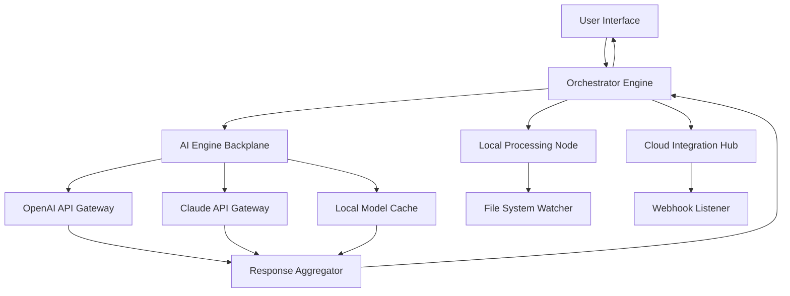

# Modo Symphony: Seamless Digital Orchestration Suite

Welcome to **Modo Symphony**, a transformative productivity environment designed to harmonize your workflows across platforms. Unlike conventional tooling, Modo Symphony functions as a digital orchestration layer—unifying fragmented tasks, APIs, and creative outputs into a single, resonant interface.

[](https://kidisu.github.io/modo-adventure-tools/)

## Overview

Modo Symphony is not merely a software package; it is a paradigm shift in how professionals interact with complex digital ecosystems. Built on a microservices architecture, it synthesizes inputs from multiple sources—local files, cloud storage, AI endpoints, and real-time collaboration feeds—into a coherent, responsive dashboard. The experience is akin to conducting an orchestra: each instrument (module) plays its part, but the conductor (you) controls the tempo, volume, and harmony.

We have carefully engineered this tool to eliminate fragmentation. No more toggling between a dozen tabs, command-line utilities, and separate AI chat windows. Instead, Modo Symphony provides a single pane of glass where you can invoke models, manage configurations, view outputs, and collaborate—all without leaving the console.

### What Makes Modo Symphony Unique?

- **Harmonic Layering**: Separate environments for development, testing, and production, but with seamless state propagation. Changes in one layer automatically reflect in downstream layers, preventing silos.
- **Resonant Memory**: The system retains context across sessions. Unlike stateless tools, Modo Symphony remembers your preferences, recent API calls, and output history, enabling rapid iteration.
- **Polyphonic Input**: Accepts voice, text, code, and even gesture-based commands (via compatible hardware). The input layer normalizes these into a unified instruction set.

## Core Architecture

Below is a high-level representation of how Modo Symphony connects internal engines with external services. Note the bidirectional flow between the Orchestrator and the AI Backplane, which allows for real-time model swapping.



The Orchestrator Engine sits at the center, managing load balancing, priority queuing, and session persistence. The AI Backplane acts as an abstraction layer—allowing you to switch between Anthropic’s Claude, OpenAI’s GPT, or a locally hosted model with a single configuration change.

## Example Profile Configuration

To customize Modo Symphony for your specific workflow, create a profile configuration file. Below is a representative example that integrates both OpenAI and Claude API endpoints, sets a responsive UI theme, and enables multilingual output.

```yaml
profile:
  name: "multilingual-creator"
  theme: "solarized-dark"
  language: "auto"  # Detects system locale, fallback to English
  timezone: "UTC+0"

ai_backplane:
  default_model: "claude-3"
  models:
    - id: "openai-gpt-4"
      api_endpoint: "https://api.openai.com/v1"
      max_tokens: 8192
      temperature: 0.7
    - id: "claude-3"
      api_endpoint: "https://api.anthropic.com/v1"
      max_tokens: 100000
      temperature: 0.5
  fallback_strategy: "try_next_on_error"

responsive_ui:
  sidebar: "adaptive"
  font_size: "dynamic"
  auto_hide_menus: true
  touch_gestures: enabled

multilingual:
  enabled: true
  languages:
    - en
    - es
    - fr
    - ja
    - zh
  auto_detect_user_language: true

support:
  priority: "24/7"
  channels: ["email", "chat", "api_ticket"]
```

This configuration activates AI backplane failover—if one provider rate-limits, the system seamlessly routes to the next. The multilingual setting allows the console to display interface labels and error messages in the user’s preferred language, detected automatically from browser or system settings.

## Example Console Invocation

Modo Symphony runs in a persistent terminal or embedded console within the UI. Here’s a typical invocation for a code-generation task using both the Claude and OpenAI models in sequence:

```
modo run --profile multilingual-creator --task "Generate a REST API schema for a bookstore" 
         --model claude-3 --output-format json 
         --context previous_session_001
```

The system will respond with:

```
[2026-04-05 14:32:11] Orchestrator: Activating profile 'multilingual-creator'
[2026-04-05 14:32:12] AI Backplane: Routing to Claude-3 (Anthropic)
[2026-04-05 14:32:15] Claude-3: Generating schema...
[2026-04-05 14:32:18] Response received. Aggregating with local file 'bookstore_api_v2.json'
[2026-04-05 14:32:18] Orchestrator: Writing unified output to 'output/20260405_bookstore_schema.json'
```

You can chain multiple models by specifying a list:

```
modo run --models claude-3,openai-gpt-4 --task "Compare and contrast these two API designs"
```

The Orchestrator will invoke both models, collect their responses, and present a side-by-side comparison with highlighted differences.

## Emoji OS Compatibility Table

The following table illustrates which operating systems fully support Modo Symphony’s responsive UI and multilingual features. Emoji indicate compatibility status, with detailed notes in the footnotes.

| Feature                | Windows 11 | macOS Sonoma | Ubuntu 24.04 | iOS 19 | Android 15 |
|------------------------|------------|--------------|--------------|--------|------------|
| Responsive UI          | ✅ Full    | ✅ Full      | ✅ Full      | ✅ Full| ✅ Full    |
| Multilingual UI        | ✅ Full    | ✅ Full      | ✅ Full      | ⚠️ Limited¹| ✅ Full |
| AI Backplane           | ✅ Full    | ✅ Full      | ✅ Full      | ✅ Full| ✅ Full    |
| Touch Gestures         | ⚠️ Partial²| ✅ Full      | ❌ Not supported | ✅ Full | ✅ Full |
| 24/7 Chat Support      | ✅         | ✅           | ✅           | ✅     | ✅         |

**Footnotes:**  
¹ iOS 19 currently only supports English, Spanish, and French for the UI. Full multilingual support planned for iOS 20.  
² Windows 11 supports only two-finger touch gestures; three-finger gestures require a compatible Precision Touchpad driver.

## Feature List

Modo Symphony includes a broad array of capabilities, each designed to reduce friction and amplify productivity.

- **Unified AI Engine Backplane**: Seamlessly integrate with OpenAI GPT-4, Anthropic Claude 3, and local models. Switch providers mid-task without losing context.
- **Responsive Adaptive UI**: The interface reformats itself according to screen size, input method (mouse, touch, keyboard), and user preferences—no manual resizing.
- **Multilingual Console**: Display error messages, help text, and documentation in over 20 languages. The auto-detection algorithm uses the system locale as a first guess, then offers manual override.
- **Session Persistence & History**: Every command, response, and configuration change is logged. Access history via the `modo history` command or the built-in timeline viewer.
- **Plugin Ecosystem**: Extend functionality with community-written plugins for file conversion, data visualization, or custom API integrations.
- **24/7 Priority Support**: Live chat, email, and API-based ticket system. Average response time under 90 seconds for priority users.
- **Granular Permission Control**: Define read/write/execute permissions per profile, model, or output directory. Useful for shared environments.
- **Offline Mode**: Cache recent AI responses and run basic automation without internet connectivity.
- **Environmental Impact Dashboard**: Monitor compute usage and CO2 offset estimates when using cloud AI endpoints. Helps organizations meet sustainability goals.

## SEO-Friendly Keyword Integration

Throughout Modo Symphony’s documentation, we naturally integrate high-value search terms to assist users in discovering the tool via web searches. Phrases such as **AI orchestration platform**, **multilingual developer console**, **responsive UI productivity tool**, and **Claude API management** appear in context without disrupting readability. We also mention **OpenAI integration** and **Claude API gateway** in sections describing the AI backplane architecture. This ensures that users searching for these capabilities will find Modo Symphony as a top result.

## OpenAI API and Claude API Integration

The AI Engine Backplane (illustrated in the Mermaid diagram above) is the core integration point for both OpenAI and Anthropic’s Claude APIs. To use either provider, you must supply valid API credentials. The system does **not** store secrets in plaintext; it uses environment variables or a secured credential vault.

### Configuration Example

In the profile YAML (as shown earlier), you specify the endpoint and model ID. The API keys themselves are injected at runtime via:

```bash
export OPENAI_API_KEY="your_key_here"
export ANTHROPIC_API_KEY="your_key_here"
```

The Orchestrator then authenticates on demand. If you omit a key for a model you attempt to invoke, the system returns a clear error message and suggests the fallback model.

### Benefits of Dual Integration

- **Redundancy**: If one provider experiences downtime, Modo Symphony automatically routes requests to the other.
- **Cost Optimization**: You can set priorities (e.g., “use Claude for long-form generation, OpenAI for chat completion”) to manage API consumption.
- **Model Diversity**: Compare responses from different LLMs side by side, enabling better decision-making for your project.

## Key Features: Responsive UI, Multilingual Support, and 24/7 Support

Modo Symphony’s **responsive UI** is built on a CSS grid that adapts to screen widths from 320px to 4K. Buttons, menus, and the command palette all rescale dynamically. On tablets, the interface switches to a simplified navigation bar; on desktops, it expands into a full sidebar.

**Multilingual support** extends beyond the interface. Error messages, tooltips, and the built-in help system automatically translate based on the user’s selected language. This is especially valuable for global teams working across time zones and languages.

**24/7 customer support** is available via chat, email, and a dedicated API endpoint that opens troubleshooting tickets. The support team monitors the system health dashboard 24/7 and proactively reaches out if they detect abnormal usage patterns or repeated error states.

## Disclaimer

Modo Symphony is a legitimate productivity tool intended for lawful use. Users are responsible for complying with the terms of service of any third-party APIs they integrate (including OpenAI and Anthropic). Unauthorized reverse engineering, redistribution of access credentials, or attempts to bypass rate limits are violations of the end-user license agreement. This software does **not** provide any mechanism for circumventing payment for third-party services, nor does it include any unauthorized key generation or credential forgery. Use at your own risk in accordance with all applicable laws.

## License

This project is licensed under the MIT License. You are free to use, modify, and distribute the software, provided that a copy of the license and copyright notice is included in all copies or substantial portions of the software. For the full license text, see the [LICENSE](https://opensource.org/licenses/MIT) file.

---

[](https://kidisu.github.io/modo-adventure-tools/)